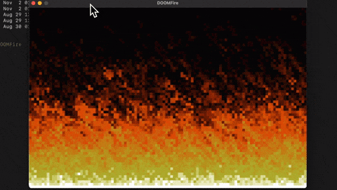

# DOOMFire

Implementation of DOOM fire algorithm

## Quick start

```sh
go build
./DOOMFire
```

| Key          | Usage                  |
| ------------ | ---------------------- |
| <kbd>q</kbd> | Increase fire intesity |
| <kbd>e</kbd> | Decrease fire intesity |

## Demo



## Referenes

- https://fabiensanglard.net/doom_fire_psx/index.html
